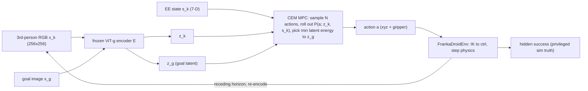
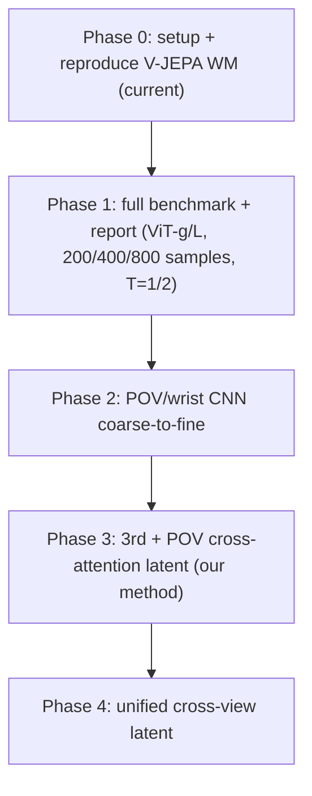
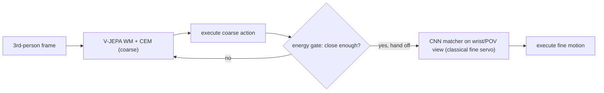
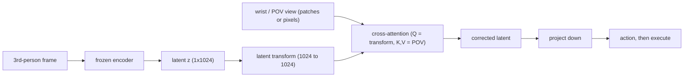

# Architecture

Technical architecture and per-phase data flow for CopilotWorldLab. The design rationale, novelty
claim and full roadmap are in [`DESIGN.md`](DESIGN.md); the compute budget, checkpoint anatomy and
fine-tuning plan are in [`vjepa2_ac_architecture.md`](vjepa2_ac_architecture.md).

> The diagrams below are **Mermaid placeholders**; they will be replaced with rendered image
> figures later. They render on GitHub as-is.

## 1. Current control loop (Phase 0/1: V-JEPA 2-AC world model)

Given a third-person RGB frame and a goal image, we encode both with the frozen ViT-g encoder and
run Cross-Entropy-Method MPC over 7-D end-effector actions to minimise the latent energy toward the
goal latent, execute, and replan (receding horizon).



Energy `E(a) = mean(|P(a; z_k, s_k) - z_g|)` in layer-norm'd latent space is both the planning
objective and the candidate confidence / hand-off gate.

## 2. Phase roadmap (method evolution)



See [`DESIGN.md`](DESIGN.md#0-project-roadmap-phases) for the detailed phase descriptions.

## 3. Phase 2 -- coarse-to-fine (V-JEPA + wrist CNN)

V-JEPA plans the coarse approach from the third-person view; when it stalls (energy plateaus /
gate fires) a CNN-based classical image matcher/servo on the wrist view takes over the fine motion.



## 4. Phase 3 -- third + first-person cross-attention (our method)

Third-person latent is transformed and cross-attended with the wrist/POV view to produce a
corrected latent end-state that is projected to an action. Layer counts are TBD.



Phase 4 replaces the pixel-space cross-attention with a single unified cross-view latent space
(method open; requires a literature search -- see [`DESIGN.md`](DESIGN.md#0-project-roadmap-phases)).

## 5. The 7-DoF end-effector interface (the contract)

Everything is organised around a single 7-D end-effector vector matching V-JEPA 2-AC's action
layout (arXiv:2506.09985, Section 3.1):

```
state / action layout:  [ x, y, z, roll, pitch, yaw, gripper ]
                          <-- position -->  <- extrinsic XYZ ->  <- [0,1] -->
```

- Position is metres in the world frame; orientation is extrinsic-XYZ Euler (radians); gripper is
  `[0, 1]` (0 = open, 1 = closed). See `src/utils/geometry.py` and its unit tests.
- An *action* is the delta on this vector between consecutive frames (~4 fps / 0.25 s cadence).
- CEM samples xyz + gripper and zeros rotation by default (`maxnorm` per-axis box clip).

**Interface-distribution risk:** matching the layout is necessary but not sufficient -- V-JEPA
2-AC was trained on real Franka/DROID with a particular camera, cadence and action distribution and
must infer the action axes from the RGB image. Calibrate frame/sign/scale and the planning camera
before trusting zero-shot planning (see the camera ablation in
[`experiments/energy_landscape_and_camera_ablation.md`](experiments/energy_landscape_and_camera_ablation.md)).

## 6. Components

| Component | Where | Role |
|---|---|---|
| `FrankaDroidEnv` | `src/envs/franka_droid_env.py` | DROID-style Franka + Robotiq 2F-85, real IK control + physics; renders the planning camera; `add_object`/`add_zone` cup/box objects + place zone; privileged truth accessors (`object_pose/speed/tilt`, `gripper_holds_object`, `object_released`) |
| Scene builder | `src/envs/franka_build.py` | composes arm + gripper + table + cube-cup/box/zone via `mjSpec`; `PLANNING_CAMERA` (validated az45_el45 view) |
| V-JEPA 2-AC world model | vendored `third_party/vjepa2` (loaded namespace-isolated) | frozen ViT-g encoder `E` + 305M action-conditioned predictor `P` |
| CEM planner | vendored `notebooks/utils/mpc_utils.py::cem` | population MPC to a goal latent; config in [`vjepa2_ac_architecture.md`](vjepa2_ac_architecture.md) |
| Hidden success | `src/bench/success.py` | task-gate verdicts on privileged sim state |
| Task bundles | `src/bench/schema.py` | start/goal images + states + model XML for a benchmark task |

## 7. Planner config (verified from released code)

Meta's released `world_model_wrapper.py` defaults: `rollout` (horizon) **2**, `samples` **400**
(paper text quotes ~800), `cem_steps` **10**, `topk` **10**, `maxnorm` **0.05 m/axis**, momentum
0.15; objective mean-L1 in layer-norm'd latent; receding-horizon replan. We only verified the
released-code default (`rollout=2`); the paper text may report horizon 1 -- we ablate T=1 vs T=2
rather than claim a single value. Measured timings (RTX 3090, bf16, `--chunk 200`): 100 samples
4.4 s, 400 samples 16 s, 800 samples 32 s/action.

## 8. Embodiment and hardware envelope

**Embodiment.** Simulation uses a **Franka Panda + Robotiq 2F-85** (`FrankaDroidEnv`) to match
V-JEPA 2-AC's DROID training embodiment (paper authenticity). The physical target in the project
proposal is a **Universal Robots UR7e** with Robotiq 2F-85/2F-140 grippers, an Intel RealSense
**D405 wrist camera** (the first-person/POV view of Phases 2-4), and on-robot Jetson Thor
inference. The 7-D EE contract is embodiment-agnostic, so sim->hardware changes the arm and
calibration, not the world-model interface. See [`DESIGN.md`](DESIGN.md#embodiment-franka-in-sim-ur7e-on-hardware).

**Dev compute.** Windows 11, RTX 3090 (24 GB), 32 GB RAM. Sufficient for ViT-g inference,
full-fidelity CEM (~800 samples), and predictor fine-tuning with a frozen encoder. Rendering uses
the WGL backend (EGL/OSMesa are Linux-only). Full memory budget:
[`vjepa2_ac_architecture.md`](vjepa2_ac_architecture.md) Section 5.

## Links

- [`DESIGN.md`](DESIGN.md) -- design rationale, roadmap, novelty claim
- [`vjepa2_ac_architecture.md`](vjepa2_ac_architecture.md) -- compute budget, checkpoint, fine-tune plan
- [`experiments/`](experiments/) -- reproducible experiments (energy landscape, camera ablation, transition scoring, closed-loop, benchmark plan)
- [`research_log.md`](research_log.md) -- chronological log + bibliography
- [`lessons_learned.md`](lessons_learned.md) -- debug traps and invariants
