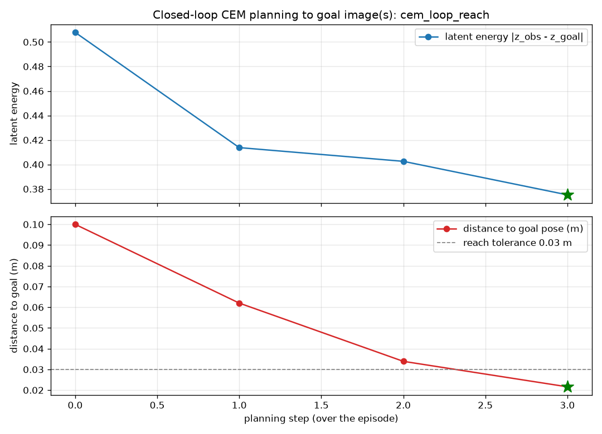
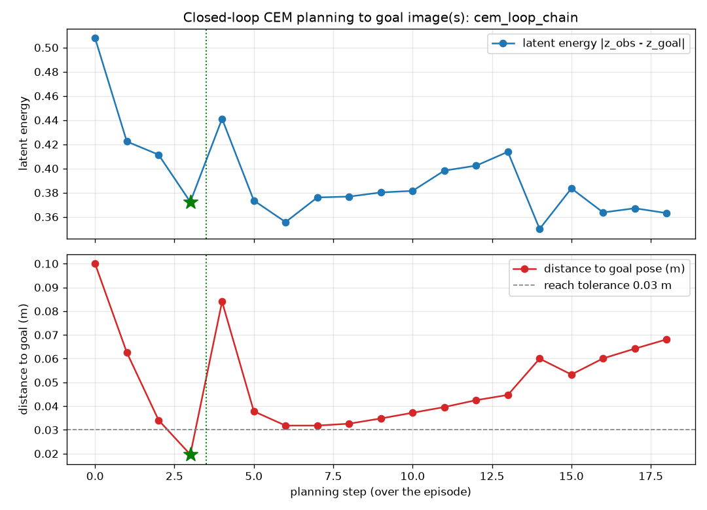

# Closed-Loop CEM Planning to a Goal Image (Phase-1 pilot)

Date: 2026-07-04. Branch: world-model-pilot. GPU: RTX 3090 (bf16).

> Status: historical pilot record. This is the early reach-only CEM proof that the env loop works; it
> precedes and is superseded by the fixed-bundle task-success benchmark
> ([closed_loop_benchmark.md](closed_loop_benchmark.md)). Any committed figures it references were
> cleared in the 2026-07-05 reset (recoverable from git history).

> Phase note (roadmap in [`../DESIGN.md`](../DESIGN.md#0-project-roadmap-phases)): this is the
> **closed-loop reach pilot** that precedes the full Phase-1 task-success benchmark
> ([`closed_loop_success_plan.md`](closed_loop_success_plan.md)). It shows the CEM env loop works;
> it is not the benchmarked success-rate result.

## Question

Can V-JEPA 2-AC drive the Franka arm in a **closed loop** to a goal image — the core of the
project — and can it chain **multiple goal images** (sub-goals), the structure a pick or stack
task needs? This is the first closed-loop planning result (the transition-scoring benchmark and
camera ablation were open-loop / one-step).

## Method

[`scripts/cem_reach_loop.py`](../../scripts/cem_reach_loop.py). Each planning step:

```
render observation from PLANNING_CAMERA (az45_el45)
  -> encode obs and the current goal image to latents z_obs, z_goal (frozen ViT-g)
  -> cem(z_obs, ee_pose, z_goal, world_model=AC-predictor) -> 7-D EE delta a*
  -> env.apply_action(a*)   (real IK + physics)
  -> repeat (receding horizon; take the first action each step)
sub-goal reached when EE is within pos_tol (3 cm) of the goal pose -> advance to next goal image
```

Goal images are captured by kinematically previewing the arm at each sub-goal pose. The
success metric is the true EE distance to the goal pose (we set the pose, so we know ground
truth); the latent energy `|z_obs - z_goal|` is logged as the planning-progress signal.
Config: samples=100, cem_steps=10, rollout=1, maxnorm=0.075, bf16 (~4.2 s/action on the 3090).

## Result 1 — single-goal reach: SUCCESS

Goal: move the end-effector +10 cm in x. Reached in 3 steps.

| step | latent energy | distance to goal (m) |
|---|---|---|
| 0 | 0.508 | 0.100 |
| 1 | 0.414 | 0.062 |
| 2 | 0.403 | 0.034 |
| 3 | 0.375 | **0.022 (reached)** |



Both the latent energy and the true distance decrease monotonically — the world model's energy
is a usable planning signal, and CEM finds actions that reduce it. This is the first
closed-loop planning success.

## Result 2 — two-goal chain (sub-goal advancement): 1/2, honest precision limit

Goals: reach +x, then reach +y from there (a 2-sub-goal chain).



- **Sub-goal 1** (+x) reached in 3 steps (dist 0.100 -> 0.024), and the controller **advanced**
  to sub-goal 2 — the goal-image sequencing works.
- **Sub-goal 2** (+y, lateral) dipped to ~0.032 m (just above the 0.03 m tolerance) at steps
  1-4, then **drifted** back out to ~0.072 m. It never crossed the tolerance.

**The drift is a model/interface limit, not a controller confound.** With the realized EE delta
now logged (audit fix), the commanded-vs-realized tracking error is **mean 9 mm, max 12 mm, and
constant across the episode** — roughly 5x smaller than the ~35-72 mm drift and not growing near
the goal. The gripper is frozen and goal/context latents share the bf16 path, so those confounds
are removed too. What remains: near the lateral goal the model keeps commanding a small spurious
`+z` (realized ~0) and small lateral corrections that do not reduce the true pose distance — the
energy landmark for this goal sits ~3 cm from the true pose and the horizontal landscape is
shallow, so the arm hovers at the model's optimum (~3 cm) and then drifts. This matches the
~8 deg view-relative residual measured in the camera ablation.

## Interpretation

- V-JEPA 2-AC is a **working coarse controller**: closed-loop CEM planning to a goal image
  succeeds, and multi-goal chaining works.
- The **precision floor is ~3-4 cm** for the vanilla model, axis-dependent, consistent with the
  view-relative frame residual. This is exactly the coarse/precise split the project's design
  assumes (coarse world-model approach, then a precise classical seat).
- This is the **baseline the improvements target**: (a) fit/freeze the App. B.4 `W*` rotation to
  remove the residual, and (b) fine-tune the predictor to sharpen the energy landscape — both
  should tighten the reach precision and let the lateral sub-goal converge. Re-running this exact
  loop after those changes gives a clean improvement delta (steps-to-reach, final distance,
  sub-goal success rate).

## Honesty / limits

- Reach success is on a single canonical goal from the home pose (n=1 per task); this validates
  the loop, it is not a success-rate benchmark (that is ManiSkill, Phase 3).
- The 3 cm tolerance sits right at the vanilla precision floor: sub-goal 1 landed at 2.4 cm
  (reached), sub-goal 2 at 3.2 cm (just over). A slightly looser tolerance would flip sub-goal 2
  to "reached", so the headline is the ~3 cm precision floor, not a hard 1/2.
- The goal here is a reach pose, not a grasped/stacked object — the pick/stack chaining is
  demonstrated with reach waypoints because the graspable-object scene is deferred
  (see [benchmark_plan.md](benchmark_plan.md)); the sub-goal machinery is ready for real goals.
- No `W*` correction is applied yet; the ~8 deg residual is a measured contributor to the drift.
- Controller confound ruled out by the logged tracking error (mean 9 mm), not assumed.

## Reproducibility

- `python scripts/cem_reach_loop.py --task reach --save-frames`
- `python scripts/cem_reach_loop.py --task chain --max-steps 15 --save-frames`
- `python scripts/plot_cem_loop.py results/cem_loop/cem_loop_chain.csv`
- Per-step CSVs are committed under `results/cem_loop/`; per-run logs in `logs/`.
