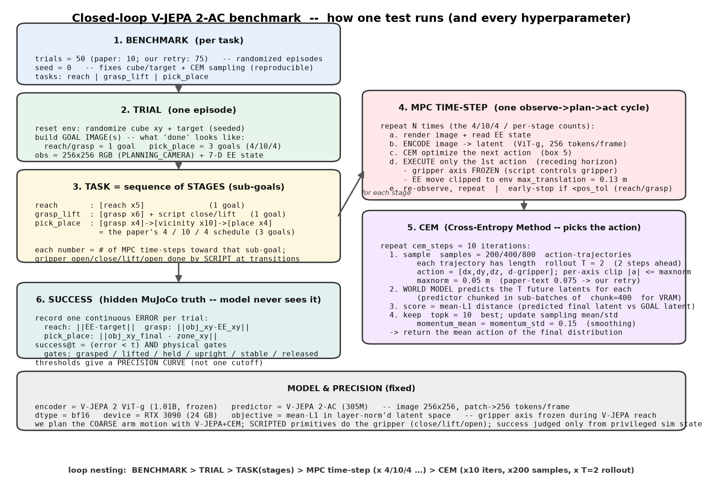

# Closed-Loop Task-Success Benchmark (V-JEPA 2-AC)

How we set up, run, score, and log the closed-loop manipulation benchmark, and the current
results. This is the paper-style **task-success** evaluation (Reach / Grasp-Lift / Place), the
Phase-1 deliverable of the roadmap ([../DESIGN.md](../DESIGN.md#0-project-roadmap-phases)). The
strategy behind it is in [closed_loop_success_plan.md](closed_loop_success_plan.md); this doc is
the operational reference and results page.

## What we measure

V-JEPA 2-AC plans the **coarse** end-effector motion by CEM-MPC to a goal image; scripted
primitives handle only the gripper. Success is judged **only** from hidden privileged MuJoCo
truth (object pose, contacts, velocity, tilt) — the model never sees it. Instead of one arbitrary
pass/fail cutoff, each rollout records a **continuous error**, and we compute success at **many
precision thresholds** from the same run (a precision curve).

| task | V-JEPA does | scripted | precision error |
|---|---|---|---|
| **Reach** | full closed-loop to a goal image | — | `‖EE_final − target‖` |
| **Grasp-Lift** | reaches the grasp pose (goal = arm at the cube) | close + lift only | `‖object_xy − EE_xy‖` before close |
| **Place** | drives the held cube over the zone | scripted grasp to start; lower-straight-down + open | `‖object_xy_final − zone_xy‖` |
| **Pick-Place** | the WHOLE composite: grasp reach → transport → place, across 3 sub-goals (4/10/4) | close after grasp; lower + open after place | `‖object_xy_final − zone_xy‖` |

No privileged re-centering is used inside the V-JEPA phase, so grasp/place numbers reflect
V-JEPA's own positioning. (The isolated *place* task scripts the *initial* grasp to isolate the
placement skill; the *pick_place* task does not — V-JEPA does the grasp too.)

## Paper protocol (verified) and our stage mapping

The number of goal images per task is taken directly from the V-JEPA 2 paper (arXiv 2506.09985
§4.2, verified against the PDF, not a summary):

| paper task | # goal images | schedule | our task | our stages |
|---|---|---|---|---|
| Single-goal reaching | **1** | single goal, replan each step | `reach` | 1 stage |
| Grasp | **1** | single goal | `grasp_lift` | 1 stage (paper-faithful default) |
| Reach-with-object | **1** | single goal | (not implemented) | — |
| Pick-and-Place | **3** (2 sub-goals + final) | **4 / 10 / 4** time-steps | `pick_place` | 3 stages, fixed 4/10/4 |

Paper goal images for pick-and-place: (1) the object being grasped, (2) the object in the
*vicinity* of the goal, (3) the object *at* the goal. Sub-goals switch on a fixed step budget
(4→10→4), not on reaching — so `pick_place` stages use `fixed_steps` (no distance early-stop).

Two honest notes on fidelity: (a) the paper's robot uses action clip **maxnorm = L1-ball radius
0.075** (~13 cm/step) and averages over **10 trials**; we default to maxnorm 0.05 (the released-code
value) and run more trials — 0.075 is a documented ablation, not our default. (b) The paper controls
the gripper via the CEM `close_gripper` schedule; we script the close/open at stage transitions,
consistent with our V-JEPA-does-spatial / scripted-does-gripper decomposition. Our **multistage
grasp** (pregrasp→grasp) is *our* addition, not the paper's single-goal grasp, so it is reported
only as a labeled ablation (`--protocol multistage`).

## How a test runs, and every hyperparameter



The benchmark is a set of nested loops:
**BENCHMARK > TRIAL > TASK (stages) > MPC time-step (x the 4/10/4 counts) > CEM (10 iters x 200
samples x T=2 rollout)**. Regenerate the diagram with `python scripts/make_benchmark_flowchart.py`.

| hyperparameter | value | what it does |
|---|---|---|
| **trials** | 50 (paper 10; retry 75) | randomized episodes per task; more = tighter success-rate estimate |
| **seed** | 0 | fixes the cube/target placement and CEM sampling for reproducibility |
| **sub-goal schedule** | reach 5; grasp 6; pick_place **4/10/4** | number of MPC time-steps spent driving toward each goal image; 4/10/4 = the paper's grasp->vicinity->place budget (3 goals) |
| **MPC time-step** | (the counts above) | one closed-loop cycle: observe image+EE state -> plan an action with CEM -> execute only the 1st action (receding horizon) -> re-observe |
| **rollout / T** | 2 | planning horizon -- how many future frames the world model predicts per candidate action-trajectory (T=2 = 2 steps ahead). Paper text sometimes says 1; released code = 2 |
| **samples** | 200 / 400 / 800 | # of candidate action-trajectories CEM draws per iteration; more = better search, more VRAM/time |
| **cem_steps** | 10 | # of CEM refinement iterations per MPC step (sample -> score -> keep topk -> re-sample) |
| **topk** | 10 | # of best candidates kept each CEM iteration to update the sampling mean/std |
| **maxnorm** | 0.05 (paper-text 0.075) | per-axis action clip in metres (max EE move/axis/step); also the initial sampling std |
| **momentum_mean / std** | 0.15 / 0.15 | how much the CEM distribution carries over between iterations (smoothing) |
| **pos_tol** | 0.015 | early-stop a reach/grasp stage when the EE is within 1.5 cm (pick_place stages run fixed steps, no early-stop) |
| **chunk** | 400 | predictor sub-batch size over the sample dimension -- caps peak VRAM (mathematically identical) |
| **dtype** | bf16 | model forward precision |
| **objective** | mean-L1 in layer-norm'd latent | CEM scores each candidate by the L1 distance between its predicted final latent and the goal latent |
| **gripper** | frozen axis | V-JEPA plans only the arm; the gripper (close/lift/open) is scripted at stage transitions |
| **model** | ViT-g encoder (1.01B) + AC predictor (305M) | frozen V-JEPA 2; image 256x256 -> 256 tokens/frame |

## Success criteria (hidden state)

A trial succeeds at precision threshold `τ` iff `error < τ` **AND** all physical gates hold:

- **Reach**: `error < τ`. Thresholds τ ∈ {5, 3, 1.5} cm.
- **Grasp-Lift**: `error < τ` AND `lifted` (object Δz > 4 cm) AND `held` (gripper–object contact)
  AND `upright` (tilt < 30°) AND `stable` (speed < 5 cm/s). Thresholds τ ∈ {6, 5, 3, 2} cm.
- **Place**: `error < τ` AND `upright` (tilt < 25°) AND `stable` (speed < 5 cm/s) AND `released`
  (gripper open and not touching the object). Thresholds τ ∈ {10, 6, 3, 1.5} cm.

Failure types are recorded categorically (grasp: missed / pushed / slipped / tipped / dropped;
place: outside_zone / tipped / unstable / still_attached).

## Environment and data

- **Embodiment**: Franka Panda + Robotiq 2F-85 in MuJoCo (`FrankaDroidEnv`), matching V-JEPA
  2-AC's DROID training embodiment (paper authenticity). The physical target is a UR7e (Stage 2).
- **Observation**: 256×256 RGB from the validated `PLANNING_CAMERA` (az45_el45 exocentric free
  camera), ImageNet-normalized (mean/std ×255 on 0–255 input) — the exact vendored `make_transforms`
  path. Plus the 7-D EE state and a goal image.
- **Object / target**: a 4 cm graspable free-joint cube (high friction, ~16 g) and a place-zone
  marker (6 cm radius).
- **Data source**: states are **generated in simulation** — no external dataset is downloaded for
  this benchmark. (The DROID download is only for the separate transition-scoring benchmark,
  [transition_scoring.md](transition_scoring.md).) Cube and reach-target positions are
  **randomized per trial** (seeded): cube xy ∈ [0.45, 0.55] × [−0.15, −0.05] m; reach target is a
  seeded offset from home.
- **Trials**: smoke = 1–5 per task (wiring); full = **50 per task**.

## CEM planning config (verified from Meta's released code)

model V-JEPA 2-AC ViT-g · samples **200** · cem_steps **10** · topk **10** · rollout **T=2** ·
maxnorm **0.05 m/axis** · momentum_mean 0.15 · momentum_std **0.15** · pos_tol **0.015 m** · bf16 ·
objective = mean-L1 in layer-norm'd latent with the gripper axis frozen · receding-horizon replan.
(Matches Meta's released `world_model_wrapper.py` robot config; `momentum_std=0.15` and
`pos_tol=0.015` set the loop to keep refining down to the tightest precision threshold. The paper
text quotes a larger population ~800 and may report horizon 1 — we ablate T=1 vs T=2 and samples
200/400/800 later. samples=200/T=2 fits the 3090 (~16 GB); **the 400/800 ablations require porting
the chunked predictor (`vjepa2_ac_infer_test.py`) first to avoid OOM** — do not attempt them until
then. See [../architecture.md](../architecture.md#7-planner-config-verified-from-released-code).)

## Protocols: single-goal vs multistage

The released `cem()` takes a single `goal_frame`, so a paper-like multi-sub-goal schedule is an
**outer loop that swaps the goal image between stages** (`--protocol multistage`), each stage
running single-goal CEM. `--protocol single_goal` uses one goal image per task (baseline).

- **Reach**: one stage in both protocols.
- **Grasp-Lift**: single_goal = one grasp goal; multistage = **pregrasp** (arm hovering above the
  cube) then **grasp** (arm around the cube). Only close+lift are scripted.
- **Place**: single_goal = one held-cube-over-zone goal; multistage = **vicinity** (held cube high
  over the zone) then **final** (held cube lowered onto the zone). The release lower+open is
  scripted. The place sub-goals keep the cube *held* (V-JEPA controls the held EE and cannot drive
  the gripper away without dragging the cube), so a held-low goal is the reachable placement target.

## How to run

```
# smoke comparison (5 trials/task, both protocols)
python scripts/run_closed_loop_benchmark.py --protocol single_goal --tasks reach grasp_lift place --trials 5 --tag single_goal_smoke
python scripts/run_closed_loop_benchmark.py --protocol multistage  --tasks reach grasp_lift place --trials 5 --tag multistage_smoke

# paper-faithful pick-and-place (3 sub-goals, fixed 4/10/4)
python scripts/run_closed_loop_benchmark.py --tasks pick_place --trials 50 --tag full

# reach / grasp full benchmark (grasp single-goal = paper-faithful)
python scripts/run_closed_loop_benchmark.py --tasks reach grasp_lift --trials 50 --tag full

# side-by-side ground-truth vs V-JEPA demo GIF
python scripts/run_closed_loop_benchmark.py --demo reach
```

## Demo: ground truth vs V-JEPA

`--demo reach` builds `results/benchmarks/closed_loop_smoke/demo_reach_compare.gif`: the **optimal
straight-line reach (GROUND TRUTH)** and **V-JEPA (ours)** driving to the *same* seeded target under
the same per-step action clip, played in sync with a live distance readout. It shows how V-JEPA's
planned path compares to the ideal (GT ~1 cm vs V-JEPA ~3 cm on the reference target).

## Logging and outputs

Every run writes two places:

- **Full run log (gitignored, for diagnosis)** — `logs/closed_loop_runs/<run_id>/`:
  - `run_config.json` — the complete inference setup: model, checkpoint SHA256, git commit,
    device, dtype, all CEM params, thresholds, gate spec, env params, normalization, seeds.
  - `steps.csv` — every step of every trial (phase, energy, planned + realized action, EE/object/
    target xyz, error, obj_dz, tilt, speed, held, released, CEM time, success, failure).
  - `trials.csv` — per-trial error, loosest-threshold pass/fail, failure, final latent energy,
    V-JEPA vs total steps, mean CEM time, and per-threshold success flags (JSON).
  - `viz/` — GIF + phase-keyed contact sheet + markdown frame table for the ~3 best / 3 median /
    3 worst trials per task (not all 50, to keep it light).
- **Committed report** — `results/benchmarks/closed_loop_<tag>/<run_id>/`: `summary.md`,
  `summary.csv`, `<task>_summary.png` (error histogram, precision curve, failure bars,
  error-vs-latent-energy scatter), and the selected GIFs/contact sheets.

Visual overlays on every frame: red = object center, blue = EE/gripper, green = target-zone
circle (3-D world points projected into the planning camera), plus a stats panel (task, trial,
step, phase, energy, action, realized, EE/object/target xyz, error, obj_dz, tilt, speed, held,
released, success/failure).

## Results

### Full run, 50 trials/task, samples=200 (paper-faithful protocols, seed 0)

The authoritative precision curves. Report:
[results/benchmarks/closed_loop_full_s200/SUMMARY.md](../../results/benchmarks/closed_loop_full_s200/SUMMARY.md).

| task | n | mean (cm) | median | p90 | success @ thresholds | main failures |
|---|---|---|---|---|---|---|
| **reach** | 50 | 2.5 | 2.4 | 3.5 | @5cm **96%**, @3cm 70%, @1.5cm 24% | too_far x2 |
| **grasp_lift** | 50 | 1.9 | 1.7 | 3.1 | @6cm **54%**, @3cm 52%, @2cm 36% | missed x22 |
| **pick_place** | 50 | 21.6 | 22.6 | 28.5 | @10cm **6%**, @6cm 2%, @3cm 0% | outside_zone x29, grasp_failed x19 |

Reading: reach is a reliable coarse skill (96% @5cm). Grasp-Lift *positions* superbly (mean 1.9 cm,
52% within 3 cm) but single-goal grasp *success* plateaus at 54% -- the grip misses on ~44% of
trials even when well positioned (the multistage pregrasp->grasp ablation closes this in the smoke).
Pick-Place (full composite) succeeds 6% at the 10 cm zone -- the honest vanilla baseline for the
hardest task, split between never-grasping (19/50) and placing outside the zone (29/50). The 400-
and 800-sample stages follow (sample ablation).

### How our results compare to the paper

The V-JEPA 2 paper (arXiv 2506.09985, Table 2/3; vendored README) reports V-JEPA 2-AC success on a
**real Franka** with **Cup/Box** objects, 10 trials, success = human-judged task completion. We run
the **same released config** (samples 400, cem_steps 10, T=2, topk 10, momentum 0.15/0.15, maxnorm
0.05 -- verified identical to `world_model_wrapper.py`) and the **same protocol** (single-goal
reach/grasp, 3-sub-goal 4/10/4 pick-and-place), but in **our uncalibrated MuJoCo sim** with a 4 cm
cube, 50 trials, and a geometric success gate. Comparing at our loosest threshold (closest analog to
their task-completion judgment):

| task | paper (V-JEPA 2-AC, real robot) | ours (sim, 50 trials) | verdict |
|---|---|---|---|
| **Reach** | 100% | **96%** (@5cm) | **reproduced** -- V-JEPA's reaching / visual-servoing transfers |
| **Grasp** | Cup 60% / Box 20% | **54%** (@6cm) | **reproduced** -- squarely in the paper's object range |
| **Pick-Place** | Cup 80% / Box 50% | **6%** (@10cm) | **large gap** -- see below |

Reach and grasp **reproduce the paper's findings**: vanilla V-JEPA 2-AC does reliable reaching
(96% vs 100%) and moderate grasping (54%, between the paper's Cup 60% and Box 20%). The
**pick-place gap (6% vs 80%/50%)** is the honest, expected shortfall and is attributable to three
differences, not a broken method: (1) **uncalibrated sim camera frame** -- we have not yet fit the
paper's App. B.4 horizontal `W*` rotation, so the held-cube transport drifts (the Phase 2 fix);
(2) **object/embodiment** -- a single small cube vs graspable Cup/Box on a real arm; (3) **stricter
scoring** -- we require object-center within a geometric zone AND physical gates, vs human task
completion. Pick-place is therefore the vanilla baseline the W* calibration + predictor fine-tuning
(Phases 2-4) must close, measured on this exact protocol.

#### Why the paper's Pick-Place (80%) beats its own Grasp (60%) -- for the same Cup

A natural paradox: pick-and-place *requires* a grasp, so how can it exceed the standalone grasp
rate? Verified from the PDF (arXiv 2506.09985 App. B, Fig. 14): the paper reports **human-judged**
success over only **10 trials** with **no numeric threshold**. The intuitive reconciliation:

- **Standalone Grasp is a stricter one-shot test** -- a single goal image of the object
  grasped-and-lifted; one imperfect attempt fails the trial.
- **The grasp inside Pick-and-Place only has to be "good enough."** PnP shows 3 goal images
  (grasp -> vicinity -> place) over 18 closed-loop steps; success is only that the object ends in
  the target. A functional-but-imperfect grip that would fail the strict standalone grasp still
  carries the object to the zone; the extra sub-goals act as a guide-rail and re-planning each step
  adds error-correction the short grasp task lacks.
- **n=10 noise**: 60->80% is a 2-trial difference.

So it is not that "placing is easier than grasping" -- the standalone Grasp is simply *measured*
more strictly than the grasp embedded in Pick-and-Place. Our benchmark scores the pick_place grasp
**strictly** (`grasp_failed` if not firmly held after the 4 fixed steps), i.e. closer to the paper's
hard standalone-grasp bar than its lenient PnP bar -- one reason our 6% looks low.


#### Where pick-place actually fails (traced over all 50 trials @200)

We use the **same 3 sub-goals on the same 4/10/4 schedule as the paper** -- the gap is *not* a
sub-goal-count or goal-state difference. Breaking down the 50 trials:

- **Grasp fails 38%** (`grasp_failed` x19): the paper's 4-step grasp sub-goal is too tight for our
  setup. On failed trials the gripper is **2.7 cm** from the cube at close-time vs **1.5 cm** on
  successful ones -- it runs out of steps before reaching. (Our *standalone* grasp uses 6 steps and
  hits 54%.)
- **Transport under-shoots 58%** (`outside_zone` x29) -- the dominant failure. The held cube needs
  to move **+25.2 cm** to the zone but V-JEPA moves it only **+5.6 cm** -- just **22% of the needed
  distance**. The direction is correct (1/31 wrong way) but **15/31 effectively STALL** (<3 cm
  moved); the x-axis error is ~0. So V-JEPA drives the cube the right way and quits ~20 cm short.

**Root cause:** the held cube is a small 4 cm object that barely registers in the latent versus the
dominant arm/gripper pose, so the CEM energy gradient flattens once the *gripper* is roughly toward
the zone and the transport stalls. The paper's large Cup/Box on a real robot with a **calibrated**
action frame (W*) are salient enough that each planned step keeps moving the object. This is an
**object-salience + uncalibrated-frame** limit -- precisely the Phase-2 (W*) and predictor
fine-tuning target -- not a goal-design flaw. (Candidate fixes to test: denser transport waypoints,
an object-emphasizing/cropped goal image, or W* frame calibration.)


### Smoke comparison, 5 trials/task, single-goal vs multistage (config above, seed 0)

Each rollout records one continuous error; `success@t` = error < t AND all physical gates. n=5 is a
wiring/comparison check, not a converged rate. Full report + GIFs:
[results/benchmarks/closed_loop_smoke/](../../results/benchmarks/closed_loop_smoke/).

| task | protocol | mean err (cm) | success @ thresholds | physical gates |
|---|---|---|---|---|
| **Reach** | both (identical) | 2.4 | @5cm **100%**, @3cm 80%, @1.5cm 20% | — |
| **Grasp-Lift** | single_goal | 2.24 | @6cm 60%, @3cm 40%, @2cm 20% | held 3/5 |
| **Grasp-Lift** | **multistage** | **1.68** | @6cm **80%**, @3cm **80%**, @2cm **60%** | held **4/5** |
| **Place** | single_goal | 15.6 | @10cm **0%** … @1.5cm 0% | released 5/5 |
| **Place** | multistage | 16.6 | @10cm **0%** … @1.5cm 0% | released 5/5 |

Honest reading:

- **Reach** is a reliable coarse skill.
- **Multistage clearly helps grasp**: the pregrasp → grasp top-down approach doubles @3cm success
  (40% → 80%), lowers error (2.24 → 1.68 cm), and raises held 3/5 → 4/5.
- **Multistage does not help place** (16.6 vs 15.6 cm, both 0%): the vicinity → final descent adds
  error with no meaningful horizontal waypoint — our place is short-horizon, unlike the paper's
  from-scratch pick-and-place.
- **Place stays poor after the goal-image fix — likely a real precision/salience limit, to confirm
  at 50 trials.** Fixing the malformed place goal image (the held cube is now rigidly carried over
  the zone rather than left behind at its grasp site — verified in `goal_image_check.png`) did
  **not** improve place (~15.6 cm, was ~15–18 cm). At n=5 this suggests a placement-precision /
  object-salience limitation rather than the old goal-image artifact; a plausible cause is that
  V-JEPA's latent similarity is dominated by the large arm/gripper pose, not the small cube, so the
  object's position in the goal image has little planning leverage. This is a preliminary reading —
  the 50-trial run is needed before any strong claim. Either way, place is the vanilla baseline the
  improvements (W* frame calibration, predictor fine-tuning, POV/cross-view; Phases 2–4) must beat.

Note on reproducibility: seeds pin the RNG (cube/target placement, CEM samples), but bf16 GPU
forward kernels are non-deterministic, so per-trial errors vary run-to-run; the 50-trial run
reports distributions (mean/median/percentiles), which are stable, rather than exact per-trial
values.

Representative rollouts (`results/benchmarks/closed_loop_smoke/`): `reach_success.gif`,
`grasp_multistage_success.gif`, `grasp_single_missed.gif`, `place_fail.gif` (+ contact sheets);
`comparison_5trial.csv` has all 30 trials. The full 50-trial precision-curve run is prepared but
not yet run.

## Reproduce

Config, seeds, and per-step data are logged under `logs/closed_loop_runs/<run_id>/` for exact
diagnosis. The runner is `scripts/run_closed_loop_benchmark.py`; success functions are pure and
unit-tested (`src/bench/success.py`, `tests/test_success.py`); the grasp physics has a regression
test (`tests/test_bench_env.py`).
