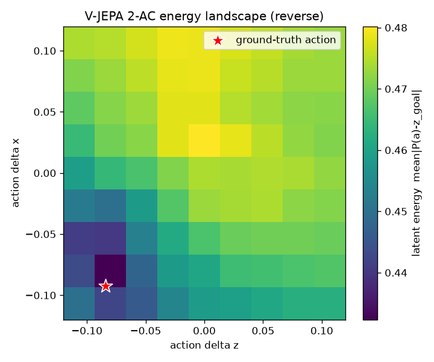
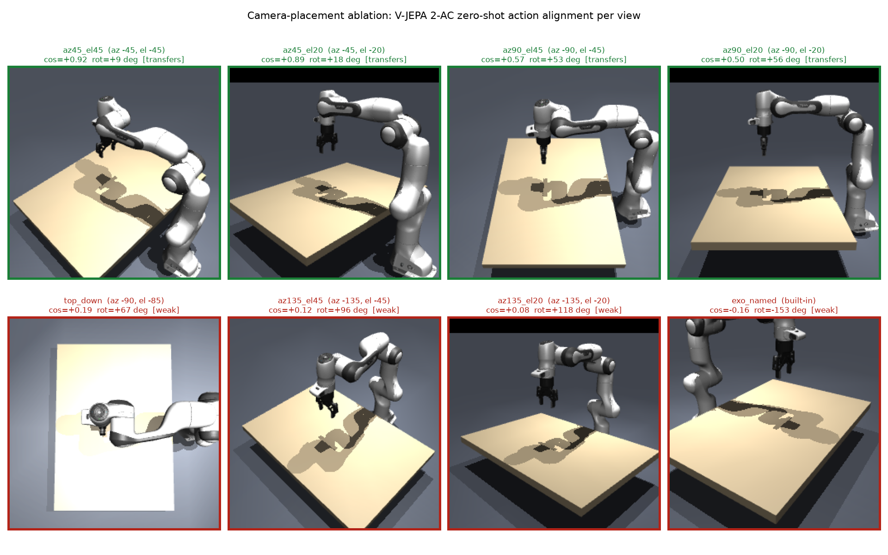
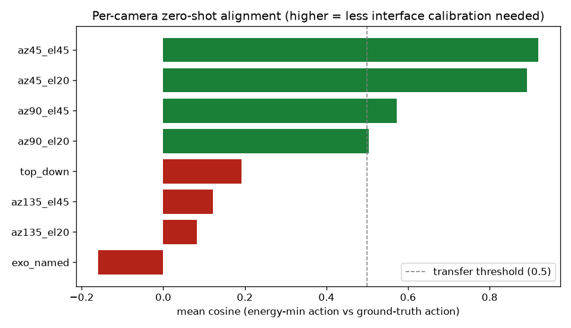
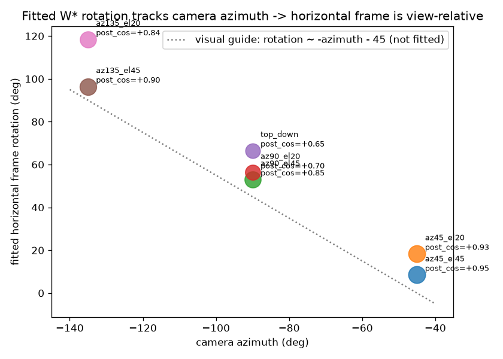

# Camera-Placement Ablation — V-JEPA 2-AC Zero-Shot Transfer to MuJoCo

Does the released V-JEPA 2-AC world model (arXiv:2506.09985), trained on real DROID Franka
video from an exocentric camera, produce a usable latent *energy landscape* on our MuJoCo
Franka renders, and which camera angle transfers best? The paper's headline success rates are
real-hardware and not reproducible in simulation; the reproducible checks are (1) the energy
landscape on the paper's own example trajectory and (2) the same analysis on our renders, with
a camera-placement ablation as the diagnosis.

Pipeline: [`scripts/energy_landscape_repro.py`](../../scripts/energy_landscape_repro.py) (score),
[`scripts/render_franka_transitions.py`](../../scripts/render_franka_transitions.py) (render),
[`scripts/analyze_frame_rotation.py`](../../scripts/analyze_frame_rotation.py) (frame fit),
[`scripts/make_ablation_figures.py`](../../scripts/make_ablation_figures.py) (figures/tables).

## Method

```
context frame, goal frame (256x256) --frozen ViT-g encoder--> latents z_ctx, z_goal
sweep n^3 grid of xyz action deltas a:
    z_next(a) = AC-predictor(z_ctx, a, pose)         # one-step rollout
    E(a)      = mean(| z_next(a) - z_goal |)          # latent energy
argmin_a E(a)  vs  ground-truth action = poses_to_diff(pose_before, pose_after)
metric: cosine(argmin action, ground-truth action);  margin = (mean-min)/std of E

transfer test / ablation:
    FrankaDroidEnv drives ONE real control step for 6 EE deltas (+/-x,y,z) x 3 start poses,
    rendered from 8 cameras (7 free azimuth/elevation placements + the exact built-in exo_cam).
    Every camera renders the SAME physical transition, so the only variable is the viewpoint.
```

Cosine measures *direction* agreement (the landscape is smooth and only near the true action,
per the paper, so we do not expect exact hits). Margin measures whether the landscape is
informative at all (near 0 = flat/blind).

**Scope.** Every result here is *one-step energy / action alignment* — how well the model's
energy ranks a single action given a context and goal frame. It is not closed-loop planning
success (that is the ManiSkill benchmark layer in
[benchmark_plan.md](benchmark_plan.md)). "Transfers" means the one-step energy is informative
and directionally correct from that view, not that a full task was completed.

## Result 1 — paper example trajectory (correctness gate): PASS

Grid wide enough to contain the ground-truth action (0.12, `9^3`):

| direction | argmin xyz | ground-truth xyz | cosine | error | margin |
|---|---|---|---|---|---|
| reverse | (-0.090, -0.060, -0.090) | (-0.092, -0.031, -0.084) | **+0.98** | 0.030 m | 3.65 |
| forward | (+0.030, +0.120, +0.060) | (+0.092, +0.031, +0.084) | +0.65 | 0.111 m | 2.93 |



The energy minimum lands near the true action, reversing the trajectory flips the dominant-axis
sign, and the landscape is informative. The forward pass has a flat y-axis so its hard argmin
wanders in y — matching the paper's own "smooth, locally convex, minimum only *near* the
ground-truth" characterization. Model load and preprocessing validated end-to-end.

## Result 2 — camera-placement ablation

144 transitions (8 cameras x 6 axes x 3 poses), grid 0.08 / `9^3`. Each camera renders the same
physical arm motion; the score is how well the model's energy-minimizing action agrees with the
true action from that viewpoint.



Summary (best zero-shot view first; improvement is over the built-in `exo_cam` we started with):

| camera | az / el | mean cos | improvement vs built-in | margin | fit rot (deg) | post-rot cos | verdict |
|---|---|---|---|---|---|---|---|
| az45_el45 **(best)** | -45 / -45 | **+0.92** | +1.08 | 2.73 | +9 | +0.95 | transfers |
| az45_el20 | -45 / -20 | **+0.89** | +1.05 | 2.76 | +18 | +0.93 | transfers |
| az90_el45 | -90 / -45 | **+0.57** | +0.73 | 2.99 | +53 | +0.85 | transfers |
| az90_el20 | -90 / -20 | **+0.50** | +0.66 | 3.08 | +56 | +0.70 | transfers |
| top_down | -90 / -85 | **+0.19** | +0.35 | 2.74 | +67 | +0.65 | weak |
| az135_el45 | -135 / -45 | **+0.12** | +0.28 | 2.82 | +96 | +0.90 | weak |
| az135_el20 | -135 / -20 | **+0.08** | +0.24 | 2.63 | +118 | +0.84 | weak |
| exo_named (built-in) | built-in | **-0.16** | -- (baseline) | 1.88 | -153 | +0.84 | weak |



**Improvement: from the built-in `exo_cam` (mean cos -0.16, anti-aligned) to az45_el45
(+0.92) is +1.08 in cosine** — the built-in camera we started with is the *worst* zero-shot
view; simply choosing az45_el45 recovers near-perfect action alignment with no calibration.

## Each angle we tried, with its own table (worst -> best)

Reading top to bottom, the mean cosine improves from the anti-aligned built-in baseline to the
best over-the-shoulder view. Each table is the per-axis cosine for that single camera angle.
Regenerated by `make_ablation_figures.py` into
[`results/camera_ablation/per_camera_tables.md`](../../results/camera_ablation/per_camera_tables.md).

#### exo_named (built-in exo_cam) — baseline

| action axis | +x | -x | +y | -y | +z | -z | mean |
|---|---|---|---|---|---|---|---|
| cosine | -0.58 | -0.35 | -0.97 | -0.90 | +0.93 | +0.93 | **-0.16** |

Energy margin 1.88 | fitted W* rotation -153 deg | post-rotation cos +0.84 | verdict: weak.
The vertical axis (+/-z) is already fine; every horizontal axis is anti-aligned.

#### az135_el20 (azimuth -135, elevation -20)

| action axis | +x | -x | +y | -y | +z | -z | mean |
|---|---|---|---|---|---|---|---|
| cosine | -0.00 | -0.13 | -0.31 | -0.90 | +0.87 | +0.96 | **+0.08** |

Margin 2.63 | fitted W* rotation +118 deg | post-rotation cos +0.84 | improvement +0.24 | weak.

#### az135_el45 (azimuth -135, elevation -45)

| action axis | +x | -x | +y | -y | +z | -z | mean |
|---|---|---|---|---|---|---|---|
| cosine | +0.29 | +0.00 | -0.11 | -0.65 | +0.96 | +0.23 | **+0.12** |

Margin 2.82 | fitted W* rotation +96 deg | post-rotation cos +0.90 | improvement +0.28 | weak.

#### top_down (azimuth -90, elevation -85 — wrist-like)

| action axis | +x | -x | +y | -y | +z | -z | mean |
|---|---|---|---|---|---|---|---|
| cosine | +0.35 | +0.40 | +0.58 | -0.41 | +0.23 | +0.00 | **+0.19** |

Margin 2.74 | fitted W* rotation +67 deg | post-rotation cos **+0.65** | improvement +0.35 | weak.
Note the vertical axis collapses here too (+z 0.23, -z 0.00): a near top-down view foreshortens
depth, so this is a genuine observability failure, not just a frame offset (see Result 3).

#### az90_el20 (azimuth -90, elevation -20)

| action axis | +x | -x | +y | -y | +z | -z | mean |
|---|---|---|---|---|---|---|---|
| cosine | +0.44 | +0.45 | +0.99 | -0.33 | +0.81 | +0.67 | **+0.50** |

Margin 3.08 | fitted W* rotation +56 deg | post-rotation cos +0.70 | improvement +0.66 | transfers.

#### az90_el45 (azimuth -90, elevation -45)

| action axis | +x | -x | +y | -y | +z | -z | mean |
|---|---|---|---|---|---|---|---|
| cosine | +0.33 | +0.49 | +0.84 | -0.13 | +0.90 | +1.00 | **+0.57** |

Margin 2.99 | fitted W* rotation +53 deg | post-rotation cos +0.85 | improvement +0.73 | transfers.

#### az45_el20 (azimuth -45, elevation -20)

| action axis | +x | -x | +y | -y | +z | -z | mean |
|---|---|---|---|---|---|---|---|
| cosine | +0.70 | +0.73 | +0.99 | +0.99 | +0.93 | +1.00 | **+0.89** |

Margin 2.76 | fitted W* rotation +18 deg | post-rotation cos +0.93 | improvement +1.05 | transfers.

#### az45_el45 (azimuth -45, elevation -45) — BEST

| action axis | +x | -x | +y | -y | +z | -z | mean |
|---|---|---|---|---|---|---|---|
| cosine | +0.92 | +0.83 | +0.90 | +0.95 | +0.91 | +1.00 | **+0.92** |

Margin 2.73 | fitted W* rotation **+9 deg** | post-rotation cos +0.95 | improvement **+1.08** | transfers.
Every axis is well aligned and the required interface rotation is negligible — this is the
zero-shot planning *view* (best one-step action alignment; not yet closed-loop planning
success), saved as `PLANNING_CAMERA` in `src/envs/franka_build.py` and used as the
`FrankaDroidEnv` default observation camera.

## Result 3 — the horizontal action frame is view-relative (confound resolved)

The absolute cosine conflates two things: how *observable* the motion is from a view, and a
fixed *frame rotation* between our world axes and the model's action axes. To separate them we
fit, per camera, the single in-plane rotation that best maps the ground-truth to the
energy-minimizing action (horizontal transitions only).



The fitted rotation tracks the camera azimuth almost linearly (-45 -> ~13 deg, -90 -> ~55 deg,
-135 -> ~107 deg); the dotted line is a *visual guide* (`rotation ~ -azimuth - 45`), not a fit.
After that single per-camera rotation, most exocentric side cameras recover to post-rotation cos
0.84-0.95 — the exception is `az90_el20` at 0.70 (see the per-camera tables). So the model infers
horizontal actions in a **view-relative frame**: the "weak" side cameras (az135, the built-in
exo_cam) are not unusable, they just need a large fixed W* rotation — exactly the paper's App. B.4
calibration. `top_down` is the other exception: even after the best rotation it only reaches cos
0.65, because a near top-down view foreshortens depth. That is a genuine observability limit.

## Key findings at a glance

| # | Claim | Evidence |
|---|---|---|
| 1 | The model reproduces the paper energy landscape (min near GT, reverse flips) | Result 1 table + reverse heatmap |
| 2 | Zero-shot transfer to MuJoCo works qualitatively (all side cameras informative, margin 2.6-3.1) | Result 2 summary table |
| 3 | **Camera angle drives a +1.08 cosine swing**; built-in exo_cam is the worst, az45_el45 the best | camera_grid + camera_ranking figures |
| 4 | Vertical (z) usually transfers from side views; horizontal (x-y) is the hard part | per-camera tables (z columns mostly ~+0.9, with view/pose exceptions) |
| 5 | **The horizontal frame is view-relative** — fitted W* rotation tracks azimuth; most side cameras recover to cos 0.84-0.95 (az90_el20 lower at 0.70) | frame_rotation figure + Result 3 |
| 6 | top_down is a genuine depth-observability failure (post-rotation cos 0.65) | top_down per-camera table |

## Findings

**Supported claims**:
- The loaded V-JEPA 2-AC reproduces the published energy-landscape behavior (correctness gate).
- Zero-shot transfer to simulator renders works qualitatively; the DROID-trained model responds
  to our MuJoCo frames (informative energy margins on all side cameras).
- Camera angle is the dominant zero-shot knob: choosing az45_el45 over the built-in exo_cam
  improves mean action-alignment cosine by +1.08 with no model change.
- The horizontal action frame is view-relative; the apparent camera ranking is largely a ranking
  of how large a fixed W* rotation each view needs, and most side cameras recover after it
  (az90_el20 is the partial exception, recovering only to cos 0.70).

**Claims to avoid without more evidence**:
- ~~"The built-in exo_cam / az135 cameras cannot be used"~~ — rejected: after a fixed W* rotation
  they recover to cos 0.84-0.90; they are uncalibrated, not unusable.
- ~~"Absolute cosine measures camera quality"~~ — it conflates observability with a fixed frame
  rotation; use the per-camera ranking and the post-rotation cosine.
- "top_down is only a frame problem" — rejected: its vertical axis and post-rotation cosine both
  degrade, indicating a real depth-observability failure.

## Reproducibility

- Render: `python scripts/render_franka_transitions.py --step 0.06 --poses 3` (144 npz).
- Score: `python scripts/energy_landscape_repro.py --traj "outputs/transitions/*.npz" --grid-size 0.08 --nsamples 9`.
- Frame fit: `python scripts/analyze_frame_rotation.py`.
- Figures + tables: `python scripts/make_ablation_figures.py` -> `results/camera_ablation/`.
- Three start poses per axis is a pilot-scale sample; the per-axis and median/min spreads are
  reported so the reader can see within-camera variance. A larger sweep would tighten estimates.
