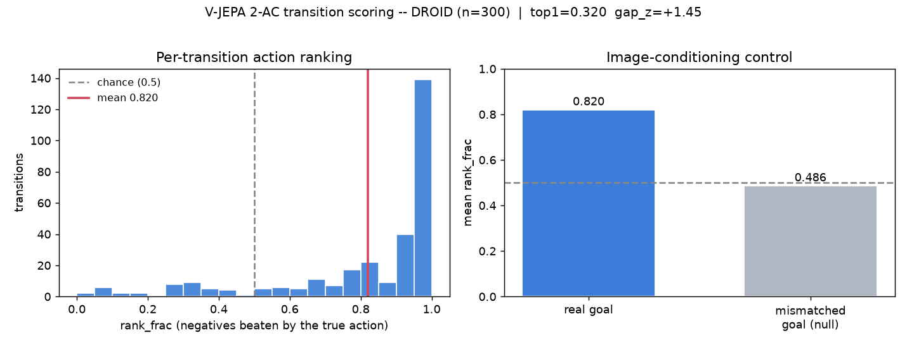

# Transition Scoring — Vanilla V-JEPA 2-AC on Real DROID (Benchmark 1)

**Question.** Does the vanilla (unmodified) V-JEPA 2-AC model actually *understand real robot
transitions* — i.e., does it score the executed action lower in latent energy than random
alternatives, and does that ranking depend on the goal image? This is a **world-model transition
sanity benchmark** (benchmark 1 in the project's evaluation plan,
[benchmark_plan.md](benchmark_plan.md)), the first honest baseline the fine-tuned predictor will
be measured against on the same protocol. It is **not** a grasp/place *task*-success benchmark:
the extracted transitions carry no task-completion labels, so it does not replace robomimic
Lift/Can/Square for measuring task success.

**Why DROID.** The intended grasp/place *task* source is robomimic (Lift/Can/Square). robomimic
does not host pre-rendered image datasets (HF ships only `low_dim` + `raw`), and the robosuite
*env runtime* does not step on this Windows setup (lessons_learned #11) — but robomimic raw
states **can** be re-rendered on Windows with direct MuJoCo + patched robosuite assets, so those
task sources remain available when success labels are needed. For a real-robot *transition*
sanity check, DROID is the natural source: it is the exact dataset V-JEPA 2-AC was trained and
evaluated on (arXiv:2506.09985; DROID arXiv:2403.12945), it is Windows-runnable, and it avoids a
self-made easy dataset.

## Method

- **Data.** `lerobot/droid_100` (100 real teleoperated Franka episodes, LeRobot v3.0: parquet
  `observation.state`/`action` + av1 mp4 cameras). We use the `exterior_image_1_left` camera.
  [`scripts/extract_droid_transitions.py`](../../scripts/extract_droid_transitions.py) decodes
  the video, reads per-frame 7-D EE state `[x, y, z, roll, pitch, yaw, gripper]`, and emits one
  npz per transition: `(image_t, state_t) -> (image_{t+H}, state_{t+H})`, `H = 5` frames (~0.33 s
  at 15 fps). Transitions with < 2 cm xyz motion are dropped. Frame/state alignment is validated
  per episode (contiguous `frame_index`; decoded frame PTS matches the parquet `timestamp` within
  < 0.5 frame — observed max 0.00), and a provenance manifest (dataset revision SHA, seed, stride,
  camera, per-episode counts) is written to
  [`results/benchmarks/droid_extraction_manifest.json`](../../results/benchmarks/droid_extraction_manifest.json).
  **n = 300** transitions from the first 20 episodes (15 per episode).
- **Score.** For each transition the true action's xyz translation (recovered from the state
  delta, rotation/gripper zeroed) is compared against **K = 32** random negative directions of
  the same magnitude (a *random-direction* ranking; hard negatives — real other-action directions
  and small angular perturbations — are future work). Latent energy
  `E(a) = mean(|P(a; z_ctx, s_ctx) - z_goal|)`. Primary metric
  is the within-transition `rank_frac` (fraction of negatives with higher energy than the true
  action; chance 0.5). [`scripts/benchmark_transition_scoring.py`](../../scripts/benchmark_transition_scoring.py).
- **Null control (image-conditioning).** The identical test is rescored with the goal latent
  taken from a **different episode** (a true scene mismatch). If the model is image-goal-
  conditioned, `rank_frac >> null ~ 0.5`. Using a same-episode neighbour as the null inflates it
  (0.74) because adjacent frames are near-identical; drawing from a different episode is the
  honest control.
- bf16, RTX 3090, seed 0.

## Result



| metric | value | meaning |
| --- | --- | --- |
| transitions (n) | 300 | real DROID `(image_t, state_t) -> (image_{t+H})` pairs |
| **rank_frac** | **0.820** | mean fraction of 32 random negatives the true xyz action beats (chance 0.5) |
| **null rank_frac** | **0.486** | same, goal from a different episode (image-conditioning control) |
| **conditioning gap** | **+0.334** | rank_frac − null; the goal-image effect |
| top1_acc | 0.320 | fraction of transitions where the true action beats ALL 32 negatives |
| gap_z | +1.45 | mean (neg energy − true energy) / std, effect size |
| AUROC (pooled) | 0.612 | true-vs-negative separability pooled across scenes (mixes global calibration) |

Source CSV: [`results/benchmarks/droid_transition_scoring.csv`](../../results/benchmarks/droid_transition_scoring.csv).

## Reading

- **Supported (evidence, narrowly bounded):** vanilla V-JEPA 2-AC has a strong goal-sensitive
  local action-ranking signal on real robot data. The true executed action is favored over random
  same-magnitude negatives (0.820) far above the different-episode null (0.486); the +0.334 gap
  is evidence the ranking depends on the goal image, since a fixed action prior would score
  identically regardless of goal. The left panel shows most transitions piling up near
  `rank_frac = 1.0`.
- **Honest limits:** (1) this is a *one-step scoring* benchmark, not closed-loop planning success,
  and carries no task-completion labels — it does not measure grasp/place success. (2) Negatives
  are *random* directions, so this is direction sensitivity against easy negatives, not hard-
  negative or full transition understanding. (3) The different-episode null is a *foreign-scene*
  control: it shows "true future goal vs a different-scene goal", not same-scene goal
  disambiguation. (4) It is harder than the curated paper example (rank 1.00, n=2) because DROID's
  exterior camera is randomized per scene and the 5-frame horizon is short; `top1 = 0.320` and
  pooled `AUROC = 0.612` reflect that per-scene energy is not globally calibrated. Actions are
  xyz-translation only. The protocol (n, H, K, seed, camera) is fixed and recorded in
  [`droid_transition_scoring_summary.json`](../../results/benchmarks/droid_transition_scoring_summary.json)
  so the fine-tuned delta is measured identically.

## What improvement will look like

The fine-tuned predictor (frozen encoder) is expected to raise `rank_frac`, `top1_acc`, and the
conditioning gap on this **exact** protocol (same n, H, K, seed, camera), and to improve pooled
AUROC via better cross-scene energy calibration. Any such delta is a falsifiable, established-
benchmark improvement rather than a self-made-dataset win.

## Reproduce

```
python scripts/extract_droid_transitions.py --max-episodes 20 --per-episode 15
python scripts/benchmark_transition_scoring.py --traj "outputs/droid_transitions/*.npz"
python scripts/plot_transition_benchmark.py --title "V-JEPA 2-AC transition scoring -- DROID (n=300)"
```

## References

- V-JEPA 2 / V-JEPA 2-AC — arXiv:2506.09985
- DROID — arXiv:2403.12945; dataset `lerobot/droid_100`
- [benchmark_plan.md](benchmark_plan.md) — the full evaluation strategy and metric table
- [../lessons_learned.md](../lessons_learned.md) — #11/#18/#19 (robosuite/ManiSkill env runtimes
  are blocked on Windows; robomimic hosts no image datasets but raw states re-render on Windows;
  DROID used for the real-robot transition sanity check)
