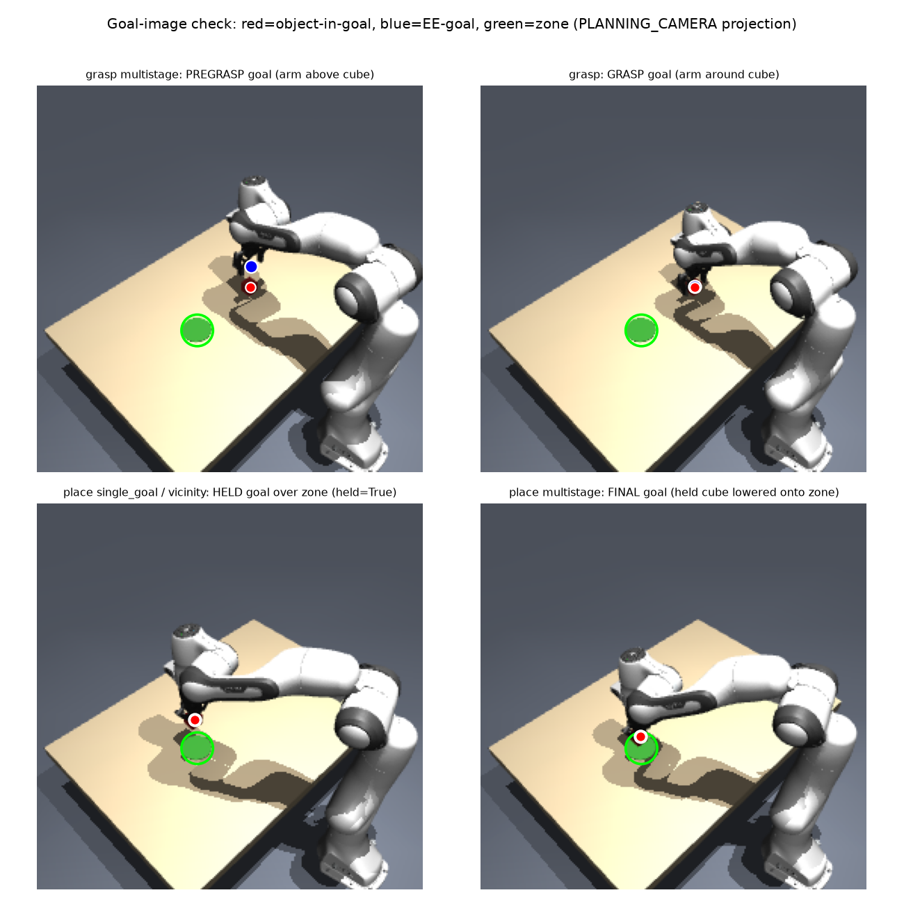
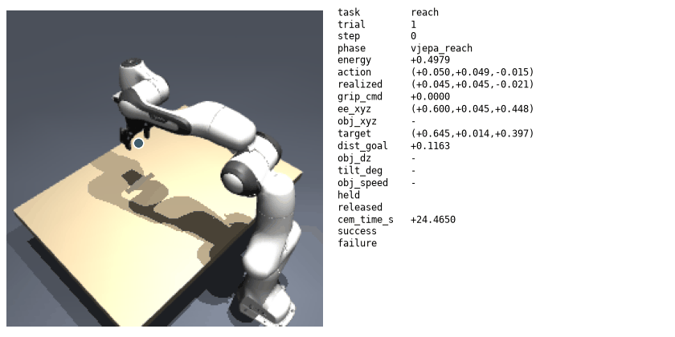
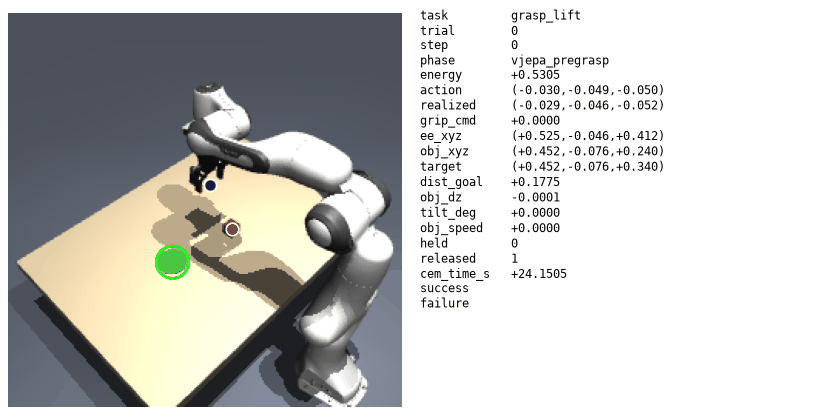
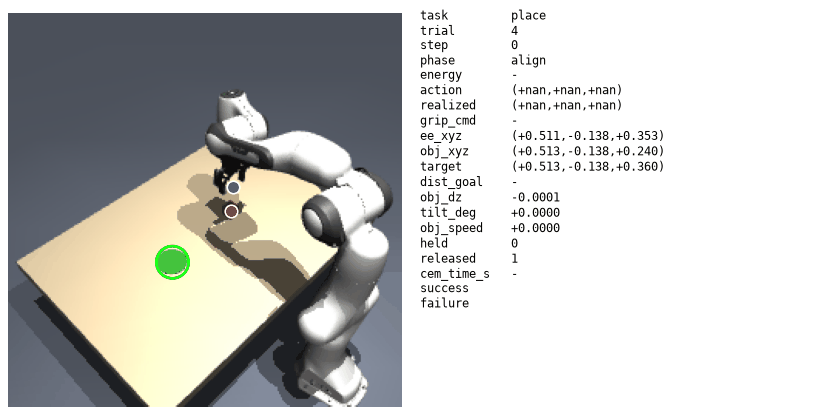

# Closed-loop smoke benchmark: single-goal vs multistage (V-JEPA 2-AC + CEM)

Config (both protocols): V-JEPA 2-AC ViT-g, samples=200, cem_steps=10, rollout/horizon T=2,
topk=10, maxnorm=0.05 m/axis, momentum_std=0.15, pos_tol=0.015, bf16, RTX 3090, seed 0, n=5
trials/task. The model sees only image + EE state + goal image (PLANNING_CAMERA); success is judged
from hidden MuJoCo truth. V-JEPA plans the coarse motion; scripted primitives handle only the
gripper. Full methodology: [docs/experiments/closed_loop_benchmark.md](../../../docs/experiments/closed_loop_benchmark.md).

Each rollout records one continuous error; `success@t` applies the benchmark precision thresholds
to that error AND requires the physical gates. n=5 is a wiring/comparison check, not a
statistically converged rate; the full 50-trial run is the authoritative precision curve. Per-run
reports: [single_goal](../closed_loop_single_goal_smoke/), [multistage](../closed_loop_multistage_smoke/).
All 30 trials: [`comparison_5trial.csv`](comparison_5trial.csv).

## Goal-image check (auditability)

Every goal image the planner optimizes toward, with red=object-in-goal / blue=EE-goal / green=zone
(PLANNING_CAMERA projection). Confirms the corrected place goals carry the **held cube over the
zone** (bottom row) rather than leaving it behind, and the grasp goals place the arm above/around
the cube (top row). Regenerate: `python scripts/goal_image_check.py` (MuJoCo-only, no GPU).

## Protocols

- **single_goal** -- one goal image per task (baseline). place uses the corrected held-object goal.
- **multistage** -- paper-like sub-goal schedule: grasp = pregrasp -> grasp; place = vicinity ->
  final. The released `cem()` takes a single goal image, so multistage is an outer loop that swaps
  the goal between stages.

## Results (mean error / success@threshold, n=5)

| task | protocol | mean err (cm) | success @ thresholds | physical gates |
|---|---|---|---|---|
| **Reach** | both (identical) | 2.4 | @5cm **100%**, @3cm 80%, @1.5cm 20% | -- |
| **Grasp-Lift** | single_goal | 2.24 | @6cm 60%, @3cm 40%, @2cm 20% | held 3/5 |
| **Grasp-Lift** | **multistage** | **1.68** | @6cm **80%**, @3cm **80%**, @2cm **60%** | held **4/5** |
| **Place** | single_goal | 15.6 | @10cm **0%** ... @1.5cm 0% | released 5/5 |
| **Place** | multistage | 16.6 | @10cm **0%** ... @1.5cm 0% | released 5/5 |

## Reach -- pure V-JEPA closed-loop (both protocols identical)

Strong: mean 2.4 cm, 100% within the 5 cm target, 80% within 3 cm.

## Grasp-Lift -- multistage (pregrasp -> grasp) clearly helps

The top-down pregrasp -> grasp approach doubles @3cm success (40% -> 80%), lowers error
(2.24 -> 1.68 cm), and raises held 3/5 -> 4/5. Single-goal misses more often (gripper closes beside
the cube):

## Place -- fails regardless of protocol (the precision gap)

Place plateaus at ~15-16 cm, well outside even the 10 cm zone, under **both** protocols. Multistage
is marginally worse (16.6 vs 15.6 cm): the vicinity -> final descent adds error with no meaningful
horizontal waypoint (our place is short-horizon, unlike the paper's from-scratch pick-and-place).

## Honest reading

- **Reach** is a solid coarse skill.
- **Multistage helps grasp** where there is a meaningful vertical waypoint.
- **Place stays poor after the goal-image fix (likely a real precision/salience limit, to confirm
  at 50 trials).** Fixing the malformed place goal image (the held cube is now carried over the
  zone, not left behind — verified in `goal_image_check.png`) did **not** improve place (~15.6 cm,
  was ~15-18 cm). At n=5 this suggests a placement-precision / object-salience limitation rather
  than the old goal-image artifact; a plausible cause is that V-JEPA's latent similarity is
  dominated by the large arm/gripper pose, not the small cube, so the object's position in the goal
  image has little planning leverage. This is a preliminary reading — the 50-trial run is needed
  before a strong claim. Place is the vanilla baseline the improvements (W* frame calibration,
  predictor fine-tuning, POV/cross-view; Phases 2-4) must beat on this exact protocol.

Goal-image audit: `goal_image_check.png` renders every goal image the planner sees (grasp
pregrasp/grasp; place vicinity/final) with red=object / blue=EE-goal / green=zone markers,
confirming the held cube is carried over the zone.

Reproduce: `python scripts/run_closed_loop_benchmark.py --protocol single_goal --tasks reach grasp_lift place --trials 5 --tag single_goal_smoke`
(and `--protocol multistage --tag multistage_smoke`).
