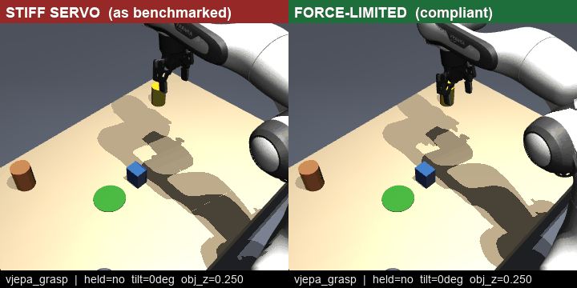
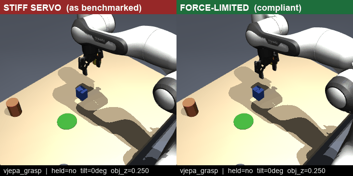
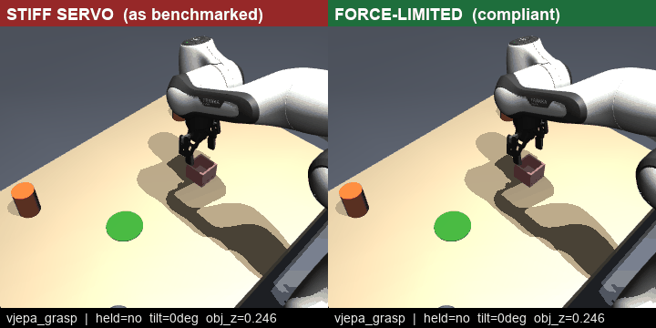

# Stiff vs. compliant arm — why the misses shove the object into the table

Watching the grasp **MISS** clips, one failure mode looks wrong for a robot: the arm drives the
gripper *down through* the object, pushing a cup or block a centimeter into the tabletop or tipping it
flat. This page isolates why, and shows a one-line physics fix — no changes to V-JEPA, no re-planning.

Each clip is the **same logged rollout** replayed twice: left under the arm as benchmarked, right with
a single knob changed. Deterministic MuJoCo from the log (`scripts/make_compliance_demo.py`).

## What the arm actually is

Our executor is a **stiff position servo**: `apply_action` solves IK to a joint target, writes it to
`data.ctrl`, and steps physics. The Franka actuators carry the real hardware torque limits
(±87 Nm at the big joints, ±12 Nm at the wrist) and **no notion of contact**. When V-JEPA's reach
lands a few centimetres off and the descent commands a pose below the object, the servo spends
whatever torque it takes — up to 87 Nm — to reach that target. 87 Nm against a 30 g object is a
bulldozer. It drives the object into the table or knocks it out from between the fingers, and the
scripted close grips air.

A real robot does not do this because its **controller** commands gentle forces near contact — not
because its motors are weak. The fix is to make the sim arm behave the same way.

## The knob: cap the contact force

Scale the arm's actuator force limit down (`--forcelim 0.5`). Free-space reaching is unchanged —
those motions need far less than half the torque — so V-JEPA's plan replays identically. The only
difference is at contact: the servo now **stalls at the object surface** instead of pushing through
it. This is a passive mechanical limit, not a force-feedback loop.

| | stiff (as benchmarked) → force-limited |
|---|---|
| **grasp / box** — object tipped to 90° and left on the table → gripped upright and lifted |  |
| **grasp / box** — object knocked out of the grasp → held and lifted |  |
| **grasp / cup** — cup never secured (held=no) → lifted clear of the table |  |

The `obj_z` readout tells the story directly: the stiff arm leaves the object at table height
(~0.24–0.25 m), the compliant arm lifts it to ~0.29–0.32 m.

## Does it raise the success rate? A little — and honestly, not much

Re-scoring the logged grasp trials under the cap, a handful of over-press misses flip to holds while a
few borderline holds regress: **net about +1 in every 25–30 trials** on both cup and box. It is a real
improvement on the failure mode you can see, but a small one on the aggregate.

The reason is the diagnosis underneath: **most grasp misses are ~3 cm horizontal reach errors**, not
over-press. When the gripper closes 3 cm to the side, the object was never between the fingers, and no
amount of contact compliance can grasp what isn't there. Force-limiting only recovers the subset where
the arm *did* reach the object but then crushed or tipped it.

Pushing the cap lower does not help: below ~0.5 the arm can no longer put out the torque to
*accelerate* through the reach trajectory, lands short, and the grasp fails for a new reason. Gravity
compensation does not rescue it either — the shortfall is dynamic tracking, not static sag. One force
budget cannot simultaneously track the reach, stay gentle on contact, and lift the object.

The clean version of this fix is **task-space impedance control** — gravity-compensated, with a low
stiffness along the contact normal and high stiffness laterally — which is the standard way real arms
grasp forgivingly. That is the promising next step; the force cap here is the one-line approximation
that already shows the effect.

> Reproduce: `python scripts/make_compliance_demo.py --task grasp --object box --trial 3 --forcelim 0.5`
> Estimate the aggregate effect from logs: `python scripts/rescore_from_log.py --task grasp --object box --forcelim 0.5`
