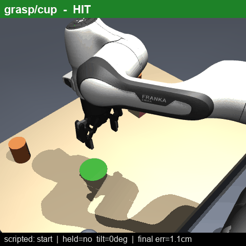
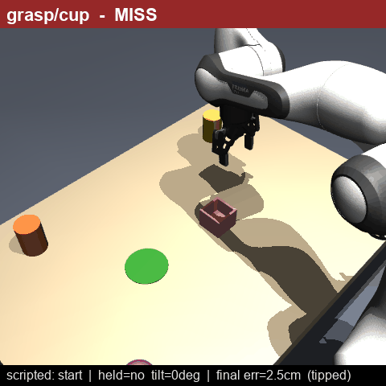
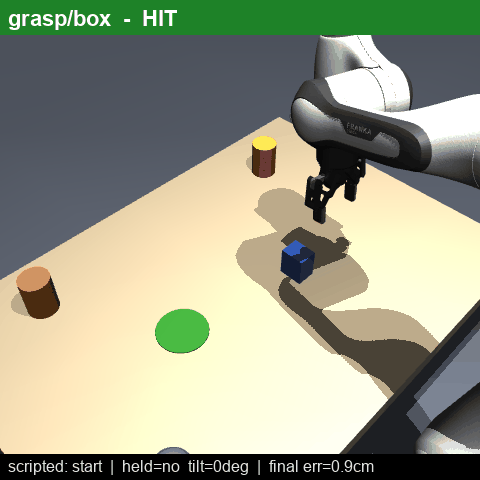
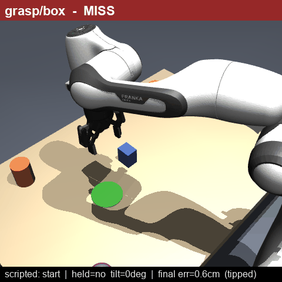
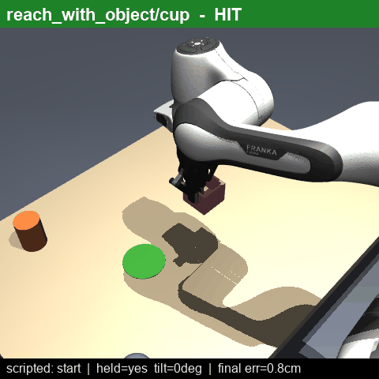
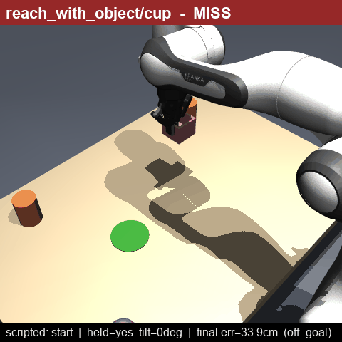
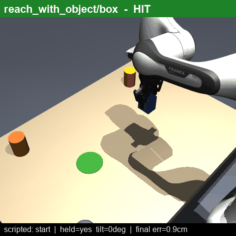
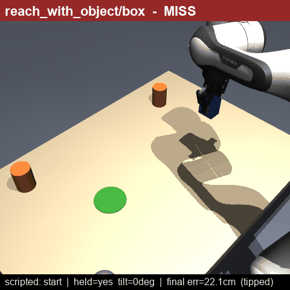
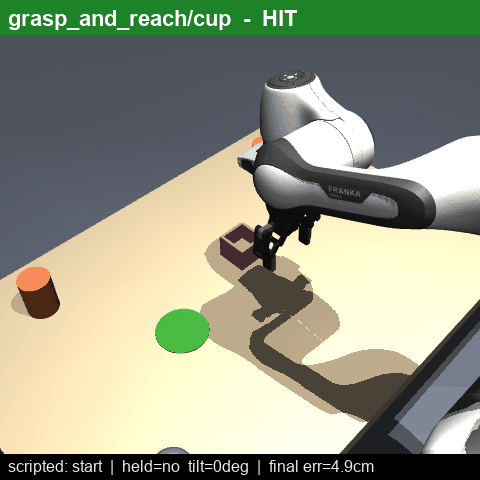
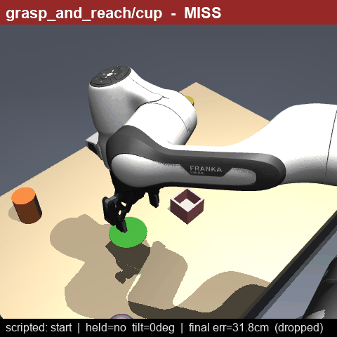

# V-JEPA 2-AC in MuJoCo — demo reel (full800_B)

Real rollouts from our **paper-faithful** closed-loop benchmark, reproduced **deterministically from
the logs** (`scripts/make_demo_gifs.py`) — we restore the fixed scenario and re-apply V-JEPA's
*logged* per-step actions, so each GIF is exactly what happened during the run (no re-planning, no
bf16 drift). One **HIT** (success) and one **MISS** (failure) per (task, object).

Config: **800 CEM samples · 10 refinement steps · top-10 · planning horizon 1 · maxnorm 0.075 ·
camera B_closer** — matching *V-JEPA 2* (Assran et al., Meta AI, arXiv:2506.09985), §4 / p.37.

Each frame is labeled with the **V-JEPA planning step `k/N`** (the greedy MPC steps; see below),
whether the object is **held**, its **tilt**, and the trial's **final error**.

---

## Results in these clips (vs paper Table 3, V-JEPA 2-AC)

| task / object | our success@loosest | paper | in the clips |
|---|---|---|---|
| grasp / cup | **38%** @6cm | 65% | HIT lands the rim; MISS reaches ~2 cm then the cup tips/slips |
| grasp / box | **10%** @6cm | 25% | HIT grips the block; MISS misses or drives into the table |
| reach_with_object / cup | **98%** @10cm | 75% | held cup carried cleanly to the goal |
| reach_with_object / box | **96%** @10cm | 75% | held block carried to the goal; rare MISS tips it |
| grasp_and_reach / cup | **18%** @10cm | (custom) | HIT grasps then carries to target; MISS grasps then drops mid-carry |
| grasp_and_reach / box | **4%** @10cm | (custom) | HIT grasps then carries; MISS mostly drives into the table on the grasp |

**reach_with_object beats the paper's real-robot rate.** The table is a hard contact: a light object
cannot be pushed into it, and if the arm drives the gripper into the tabletop the trial fails outright
(labeled `hit_table`) instead of tunneling through. Grasp misses are mostly a few-cm reach error
before the object tips or slips. The compositional **grasp_and_reach** (grasp off the table, then
carry) is now the hardest task: the grasp phase must land cleanly first, and on the box the arm mostly
bulldozes the table (`hit_table`), so the composite falls to a few percent.

---

## Grasp — V-JEPA plans the reach; scripted close + lift

| | HIT | MISS |
|---|---|---|
| **cup** |  |  |
| **box** |  |  |

## Reach-with-object — object starts held; V-JEPA carries it to a goal image

| | HIT | MISS |
|---|---|---|
| **cup** |  |  |
| **box** |  |  |

## Grasp-and-reach — V-JEPA grasps off the table (goal 1), then carries it to a target (goal 2)

A 2-sub-goal composite: it chains the weak grasp with the strong held-carry, so success (~31% on cup)
tracks the grasp landing; the common MISS is the object *dropped* during transport.

| | HIT | MISS |
|---|---|---|
| **cup** |  |  |

---

## Why the arm moves one step at a time — greedy horizon-1 MPC

V-JEPA 2-AC is a **latent world model**: it predicts the *representation* of the next camera frame
given an action. It has no controller and no reward. Motion comes from **model-predictive control
(MPC)** that, at every control step, searches for the action whose predicted next latent is closest
to the **goal image's** latent (an energy = L1 distance in latent space).

**One step at a time (greedy, horizon 1).** Per the paper (p.37), planning uses a **horizon of 1** —
each candidate is a *single* next action, not a multi-step plan. At every control step the controller:

1. renders the current camera frame and encodes it,
2. runs the **cross-entropy method (CEM)**: sample **800** candidate actions → predict each one's
   next latent with V-JEPA → keep the best **10** → refit the sampling distribution → repeat for
   **10 refinement steps**,
3. **executes only the first action**, then **re-observes and replans** from scratch.

This is *greedy*: the controller never looks beyond the next step. It works because the V-JEPA 2-AC
energy landscape is **smooth and locally convex** near the goal (paper Fig. 9), so repeatedly
descending it one step at a time walks the arm toward the goal image — a learned form of visual
servoing. The `k/N` counter in each clip is exactly these greedy planning steps (`N` varies:
single-goal tasks **stop early** once the end-effector is within tolerance of the goal).

**Fixed step schedule (why "certain steps").** Because planning is greedy with no success detector,
compositional tasks are driven by a **hand-designed temporal schedule of sub-goal images**, switched
by *time index*, not by detecting success. For **pick-and-place** the paper uses **4 / 10 / 4**:
optimize toward sub-goal 1 (grasped) for 4 steps, sub-goal 2 (near the target) for 10, the final goal
for 4. We reproduce this exactly. Single-goal tasks here (grasp, reach-with-object) run the same
greedy loop toward one goal image up to a small step budget. The scripted gripper close/open happens
at the fixed stage boundaries — the honest separation is that **V-JEPA owns the coarse motion**, and
only the gripper open/close is scripted.

> Reproduce/refresh: `python scripts/make_demo_gifs.py` — auto-picks 1 HIT + 1 MISS per completed
> group and reproduces them from the logs (no GPU model needed).
